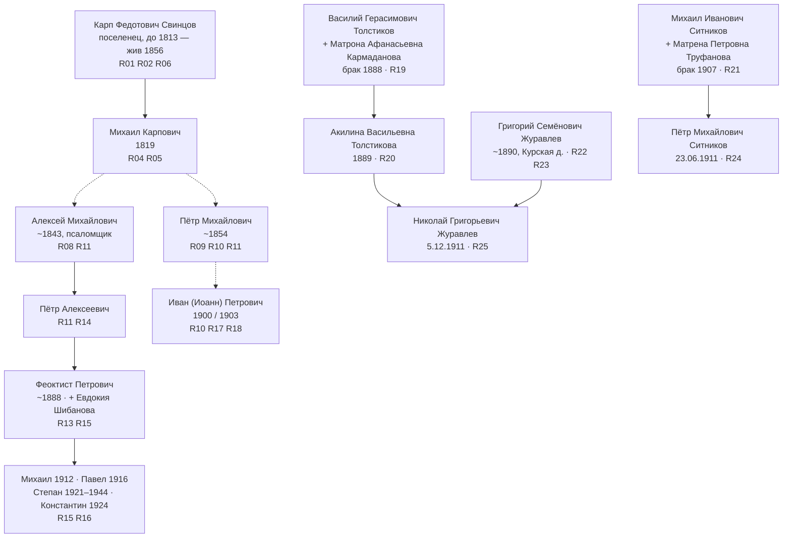

# Схема родства

Сплошная линия — подтверждено записью; пунктир — гипотеза или вероятная связь. Номера R.. — строки из [`records.csv`](records.csv).

```mermaid
flowchart TD
  K["Карп Федотович Свинцов<br/>поселенец, до 1813 — жив 1856<br/>R01 R02 R06"]
  M["Михаил Карпович<br/>1819<br/>R04 R05"]
  A["Алексей Михайлович<br/>~1843, псаломщик<br/>R08 R11"]
  P["Пётр Михайлович<br/>~1854<br/>R09 R10 R11"]
  PA["Пётр Алексеевич<br/>R11 R14"]
  F["Феоктист Петрович<br/>~1888 · + Евдокия Шибанова<br/>R13 R15"]
  FS["Михаил 1912 · Павел 1916<br/>Степан 1921–1944 · Константин 1924<br/>R15 R16"]
  I["Иван (Иоанн) Петрович<br/>1900 / 1903<br/>R10 R17 R18"]
  K --> M
  M -.-> A
  M -.-> P
  A --> PA --> F --> FS
  P -.-> I

  VT["Василий Герасимович Толстиков<br/>+ Матрона Афанасьевна Кармаданова<br/>брак 1888 · R19"]
  AK["Акилина Васильевна Толстикова<br/>1889 · R20"]
  GZ["Григорий Семёнович Журавлев<br/>~1890, Курская д. · R22 R23"]
  NZ["Николай Григорьевич Журавлев<br/>5.12.1911 · R25"]
  MS["Михаил Иванович Ситников<br/>+ Матрена Петровна Труфанова<br/>брак 1907 · R21"]
  PS["Пётр Михайлович Ситников<br/>23.06.1911 · R24"]
  VT --> AK
  AK --> NZ
  GZ --> NZ
  MS --> PS
```
